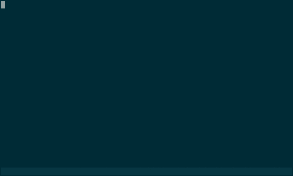

 

screenfill.sh
====

Usage
----

<pre><code>
</code></pre>

Requirements
----

- Bash (https://www.gnu/org/software/bash/)
- GNU Awk (https://www.gnu/org/software/gawk/)

Todo / Add
----

License and Author
----

Author:: Cesar Bodden (cesar@pissedoffadmins.com)

Copyright:: 2016, Pissedoffadmins.com

This program is free software: you can redistribute it and/or modify
it under the terms of the GNU General Public License as published by
the Free Software Foundation, either version 3 of the License, or
(at your option) any later version.

This program is distributed in the hope that it will be useful,
but WITHOUT ANY WARRANTY; without even the implied warranty of
MERCHANTABILITY or FITNESS FOR A PARTICULAR PURPOSE.  See the
GNU General Public License for more details.

You should have received a copy of the GNU General Public License
along with this program.  If not, see <http://www.gnu.org/licenses/>.
